# Складской учет

Полноценная система складского учета с поддержкой нескольких складов,
документооборотом (приход, расход, перемещение, инвентаризация),
управлением товарами, контрагентами и отчетами с экспортом в Excel, PDF и CSV.

## О проекте

Приложение разработано в рамках производственной практики студенткой
**Комаричевой Ириной Романовной**, группа **ИСС-32**.

- Платформа: .NET 10 (Windows Forms)
- Язык: C#
- Хранилище: JSON-файлы (без СУБД, без сервера)
- Архитектура: MVC с элементами паттернов Observer, Factory Method, Strategy, Memento

## Скриншоты

### Главное окно

Боковая навигация по разделам, приветственный экран, статус-бар с текущим
пользователем и временем.

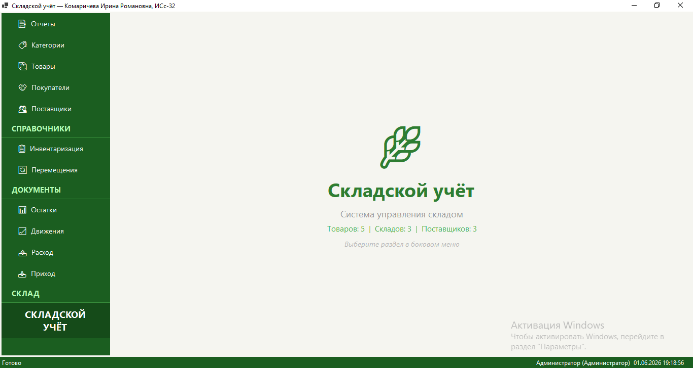

### Справочники: Товары

Список номенклатуры с поиском по названию/SKU, фильтрацией по категории и
активности. Видны закупочная и продажная цена, процент наценки.

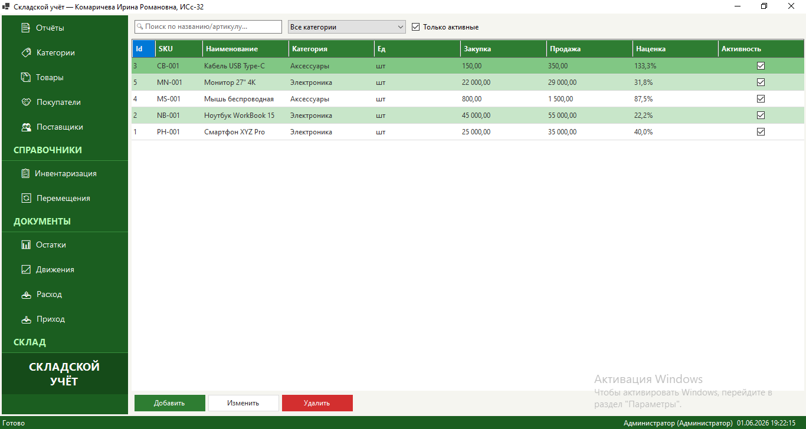

### Справочники: Поставщики

CRUD-операции над поставщиками: наименование, ИНН, контактное лицо,
телефон, email.

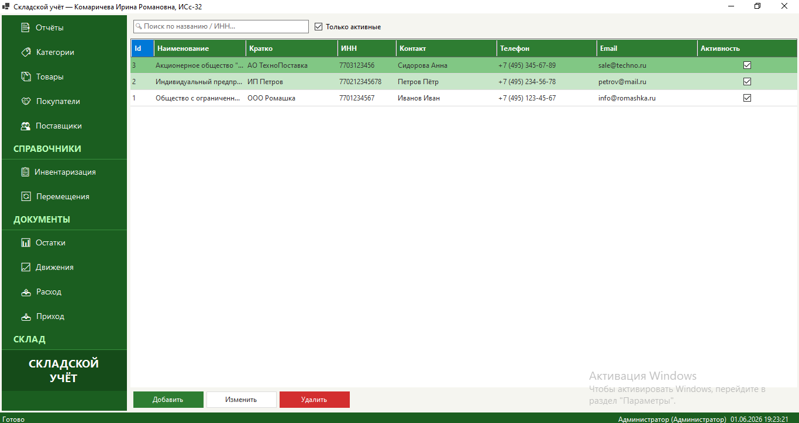

### Справочники: Покупатели

Аналогичный справочник для покупателей. Используется в расходных
накладных.

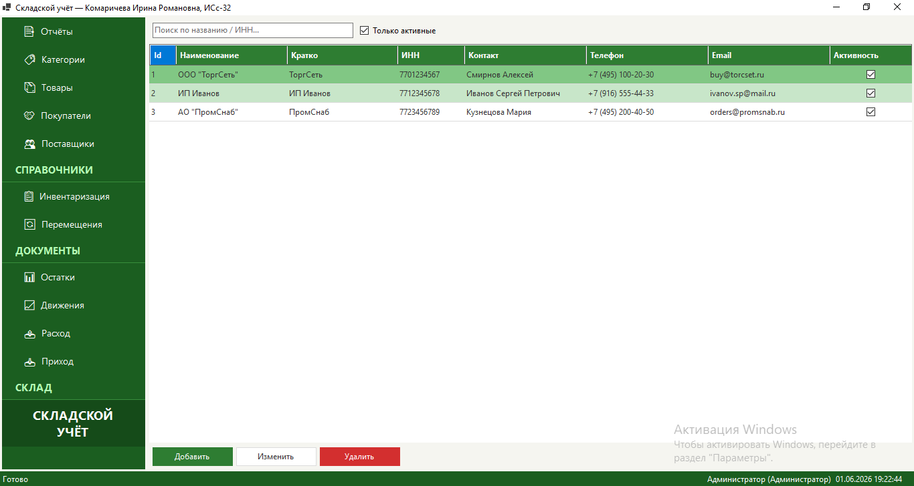

### Справочники: Категории товаров

Иерархический справочник категорий (родитель-потомок).

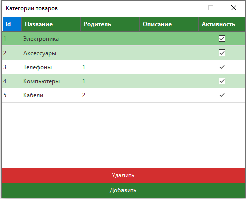

### Документы: Приход

Приходная накладная: поставщик, склад, табличная часть с товарами.
Поддерживается черновик - можно добавлять строки, закрывать форму и
продолжать позже.

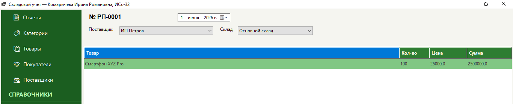

### Документы: Расход

Расходная накладная с выбором склада и покупателя из справочника.
Показывается остаток товара на выбранном складе (колонка "Доступно").

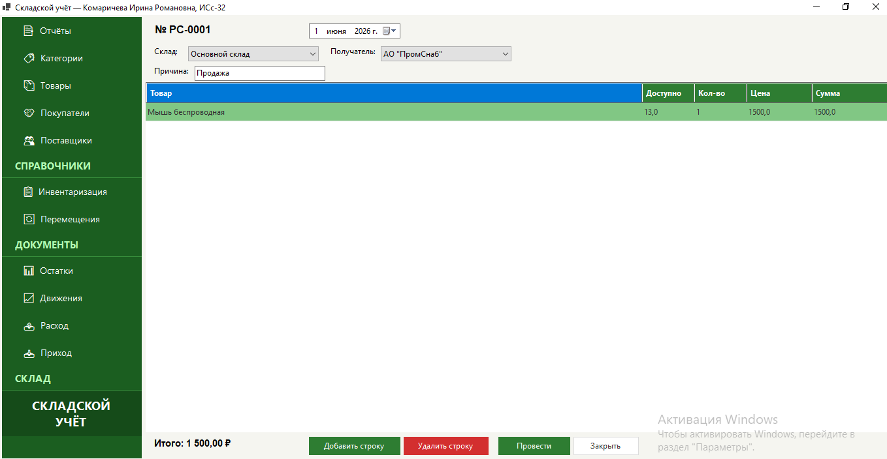

### Документы: Инвентаризация

Сверка учетного и фактического количества. Колонка "Отклонение"
подсвечивается: зеленый - излишек, красный - недостача.

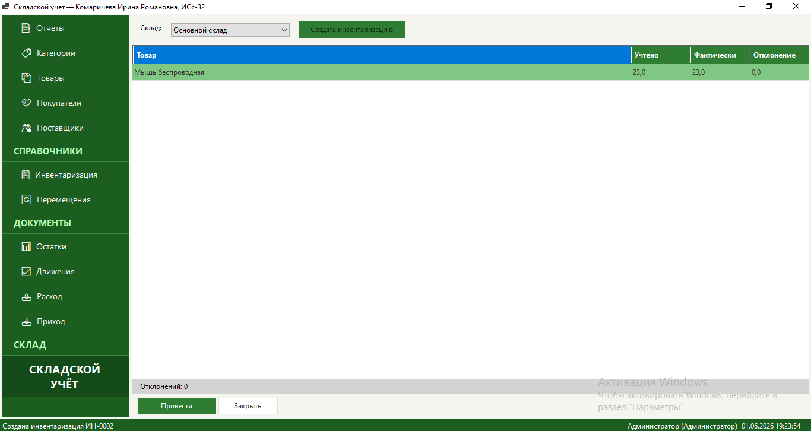

### Склад: Остатки

Текущие остатки по всем складам. Поиск по товару, фильтр "Только дефицит".

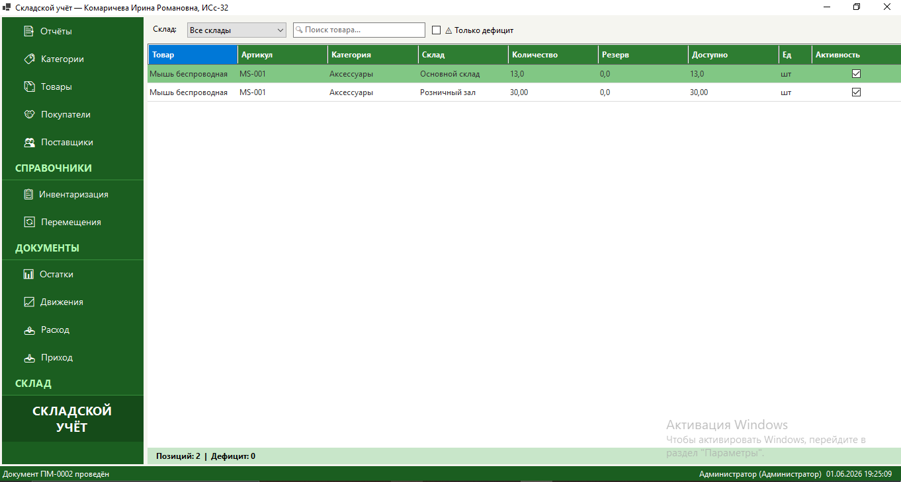

### Склад: Движения

История всех движений товара (приход, расход, перемещение) за выбранный
период с фильтрами по товару и складу.

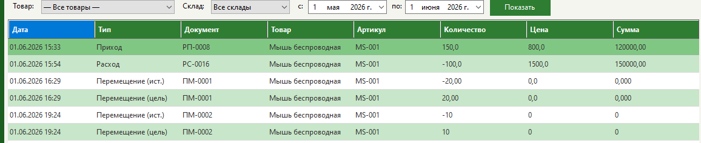

### Отчеты

Формирование отчета "Остатки на складе" с экспортом в Excel, PDF или CSV.

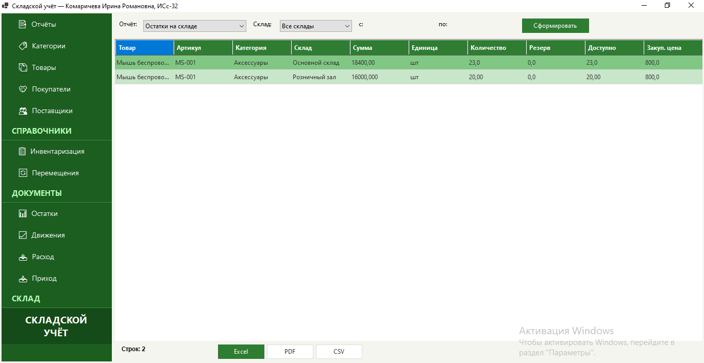

## Основной функционал

| Модуль | Возможности |
|---|---|
| Склад | Несколько складов, остатки, резервирование, минимальный порог |
| Документы | Приход, расход, перемещение, инвентаризация, черновики |
| Справочники | Товары, категории, поставщики, покупатели |
| Движения | Полная история движений с фильтрами |
| Отчеты | Остатки, обороты, экспорт в Excel / PDF / CSV |
| Авторизация | Роли Admin / Storekeeper (вход под admin / admin) |

## Стек

- C# 12, .NET 10 (Windows Desktop)
- Windows Forms
- Newtonsoft.Json - сериализация данных
- ClosedXML - экспорт в Excel
- iTextSharp - генерация PDF
- BouncyCastle - криптография для PDF

## Запуск

1. Клонировать репозиторий
2. Открыть `СкладскойУчет.sln` в Visual Studio 2022+ (с workload ".NET desktop development")
3. Убедиться, что установлен .NET 10 SDK
4. Нажать F5 - приложение запустится, демо-данные создадутся автоматически
5. Войти под `admin` / `admin`

## Структура решения

```
СкладскойУчет/
|-- Models/                Классы данных (сущности предметной области)
|   |-- Documents/         Складские документы (приход, расход, перемещение, инвентаризация)
|   |-- Product.cs         Товар / номенклатура
|   |-- Category.cs        Категория товаров
|   |-- Supplier.cs        Поставщик
|   |-- Customer.cs        Покупатель
|   |-- Warehouse.cs       Склад
|   |-- StockItem.cs       Остаток (товар x склад)
|   `-- User.cs            Пользователь системы
|
|-- Controllers/           Бизнес-логика
|   |-- AuthController     Авторизация
|   |-- ProductController  CRUD номенклатуры
|   |-- StockController    Остатки и движения
|   |-- SupplierController Поставщики
|   |-- CustomerController Покупатели
|   |-- DocumentController Приход / расход / перемещение / инвентаризация
|   `-- ReportController   Формирование отчетов
|
|-- Services/              Инфраструктурные сервисы
|   |-- DataService        Сохранение / загрузка JSON
|   |-- ValidationService  Проверка данных
|   |-- ExportService      Экспорт Excel / PDF / CSV
|   |-- ReportFactory      Фабрика отчетов
|   |-- PrintService       Печать документов
|   `-- UITheme            Стилизация форм (зеленая тема)
|
|-- Forms/                 WinForms UI
|   |-- MainForm           Главное окно с боковой навигацией
|   |-- Products/          Справочник товаров
|   |-- Stock/             Остатки и движения
|   |-- Documents/         Приход, расход, перемещение, инвентаризация
|   |-- Suppliers/         Справочник поставщиков
|   |-- Customers/         Справочник покупателей
|   `-- Reports/           Отчеты
|
|-- Data/                  JSON-файлы данных (создаются при первом запуске)
`-- Resources/             Иконки и ресурсы

docs/                       Скриншоты интерфейса (для README)
СкладскойУчет.sln           Файл решения Visual Studio
```

Скриншоты лежат в корневой папке `docs/`, а исходный код проекта - в
подпапке `СкладскойУчет/`.

## Демо-данные

При первом запуске автоматически создаются:

- 3 склада (Основной склад, Розничный зал, Транзитный)
- 5 категорий товаров
- 6 товаров (смартфон, ноутбук, монитор, мышь, кабель)
- 3 поставщика (ООО Ромашка, ИП Петров, АО ТехноПоставка)
- 3 покупателя (ООО ТоргСеть, ИП Иванов, АО ПромСнаб)
- Пользователи admin (полный доступ) и user (только просмотр)

